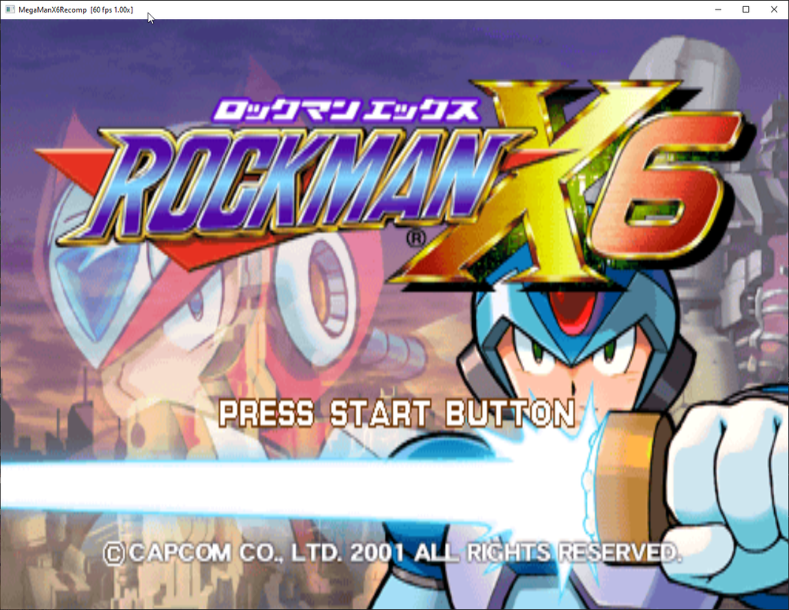
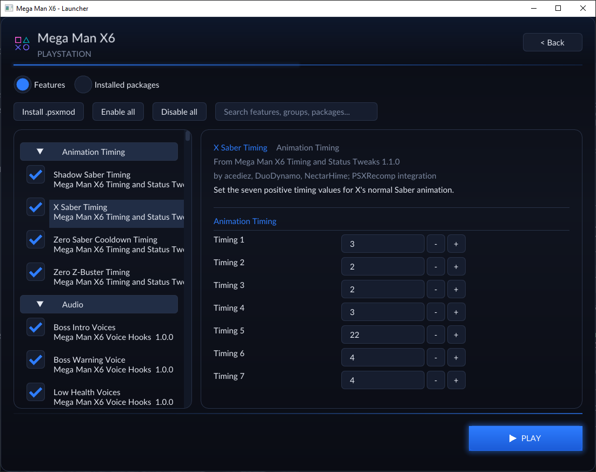
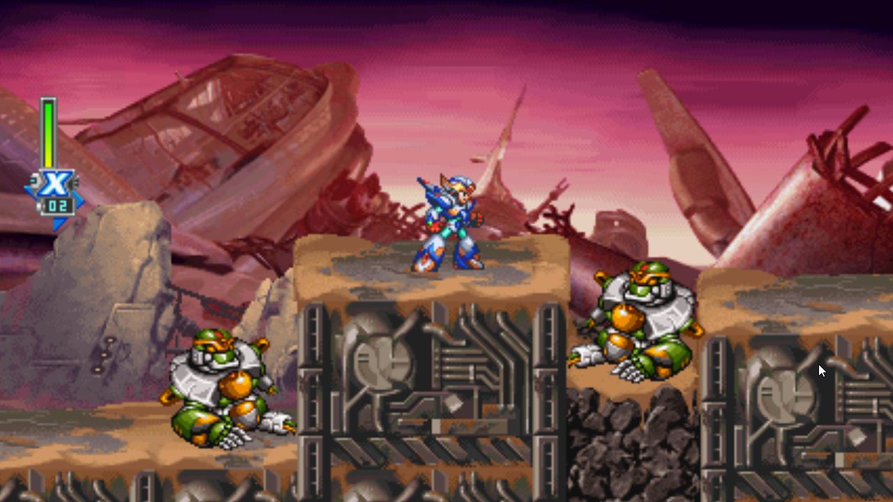

# MegaManX6Recomp

> _This recompilation is a **byproduct of developing
> [psxrecomp](https://github.com/mstan/psxrecomp)** — the games are the proving ground, the framework is the goal.
> **These are in-development previews, not finished ports — expect rough
> edges**, and depth will keep landing over months, not days. My time for any
> one title is limited, so I ask for your patience. Contributions are welcome —
> testing, issues, and PRs to the game or framework all help and will
> accelerate this game's polish. More on the why at:
> [Recomp + AI: 5 Months Later »](https://1379.tech/recomp-ai-5-months-later/)_

Mega Man X6 (USA, SLUS-01395, disc revision **v1.1**) statically recompiled to a
native PC executable with [PSXRecomp](https://github.com/mstan/psxrecomp) — the
same framework behind [TombaRecomp](https://github.com/mstan/TombaRecomp).

## What This Is

This repository contains the game-specific configuration, seeds, tools, and
build glue for running Mega Man X6 on the PSXRecomp framework. The game's MIPS
code is machine-translated ("recompiled") ahead of time into native C, then
compiled into a real Windows program that runs the game's own logic on a
faithful simulation of the PS1 hardware (GPU, SPU, GTE, memory cards) plus the
real, recompiled PS1 BIOS — no high-level emulation shims.

It does **not** contain the Mega Man X6 disc image, a retail PS1 BIOS, generated
game code, or any decompiled game C. Release builds include the MIT-licensed
OpenBIOS from PCSX-Redux; game data and an optional retail BIOS come from your
own legally obtained assets.

The Mods catalog incorporates an adaptation of **Mega Man X6 Tweaks**, authored
by [acediez](https://twitter.com/acediez) ([RHDN project thread](https://www.romhacking.net/forum/index.php?topic=26507.0)).
acediez explicitly granted permission to adapt and ship his work as part of
Mega Man X6 Recompiled. Every included tweak remains opt-in and disabled by
default.

The English retranslation by
[DuoDynamo](https://twitter.com/DuoDynamo) is included with his direct
redistribution approval and remains opt-in and disabled by default. The extra
portrait/palette work credited to MetalWario64 is neither included nor enabled
while separate approval remains pending. See
[`mods/preloaded/ATTRIBUTION.md`](mods/preloaded/ATTRIBUTION.md).

Important files:

- `game.toml`: runtime / recompiler / video / controller / widescreen config.
- `mods/preloaded/`: built-in mod catalog and attribution/permission ledger.
- `seeds/`: Ghidra-derived function starts and game-specific seed data.
- `tools/regen.ps1`: regenerates the recompiled C output.
- `tools/package_release.ps1`: builds the redistributable release zip.
- `psxrecomp-v4` Git submodule: the pinned framework revision.
- `ISSUES.md`: game-specific issue log.
- `DISC.md`: source-disc identity and verification hashes.
- `WIDESCREEN.md`: design notes for the experimental 16:9 mode.

## Status

**Playable preview — `v0.0.1-alpha`.** This is the *first* public cut. Mega Man
X6 **boots from the PS1 BIOS and plays** — through the opening, into stages, with
working controller input and memory-card **save/load**, and **no known crashes**.
It has not yet been verified all the way to the end, so treat it as a very
playable preview rather than a certified full playthrough.

| Area | State |
|---|---|
| PS1 BIOS boot | Works (real recompiled BIOS) |
| Disc-detect / boot | Works (loads `ROCK_X6.DAT`, reaches the engine) |
| X-vs-Zero / Space Colony intro FMV | Plays; opt-in skip features available under Mods |
| Controller | Works; DualShock/analog and rumble supported |
| Stage gameplay | Works (not yet verified all the way to the end) |
| Memory-card save / load | Works (standard PS1 `.mcd`, emulator-compatible) |
| Renderers | Software **and** OpenGL (GPU); Software is the default this release (see ISSUES.md #7), OpenGL selectable |
| Custom Renderer | Experimental, opt-in; Adaptive or fixed 16:9 / 21:9 / 32:9 |

Known issues: see [`ISSUES.md`](ISSUES.md) for the current issue log (including
renderer notes) and the remaining enhancement follow-ups.

## Enhancements

### X + Zero co-op (experimental 0.0.1)

Enable **X + Zero Co-op** on the launcher's Mods page for local play. The bundled
mod is marked **Experimental**, version **0.0.1**, and disabled by default.
Netplay uses the shared PSX delay-sync transport
with X as P1 and Zero as P2. The built-in co-op logic is enabled for both peers;
ordinary offline mod selections remain separate. Use identical builds and the
supported v1.1 disc and OpenGL renderer. Select your local controller on the launcher's P1/Netplay
card, then host or join through **Netplay**.

**Settings → Display → Netplay aspect** offers fixed 4:3, 16:9, and 21:9.
Choose it before hosting; the host's choice applies to both peers. Adaptive is
excluded. The wide choices use the full enhanced renderer: host background
packets, room-edge framing, guarded enemy activation, and native dialogue/effect
handling. Window resizing cannot change the match's view or activation bounds.
Both native HUDs anchor to the left edge with their normal spacing. Offline
widescreen continues to use its Mods selection, including adaptive Fit.

Bundled OpenBIOS is the default. Co-op netplay skips the BIOS shell animation
while running kernel initialization and disc loading normally. A selected retail
BIOS remains supported. Ordinary game memory-card saves remain available;
rollback and save states are disabled for this milestone because the co-op's
host-owned simulation state is not yet serialized.

Validated on two private local peers: OpenBIOS boot with shell skip, both seats'
movement through transported input, P2 leave/rejoin with health preserved,
native Zero/HUD rendering, and fixed 4:3/16:9/21:9 output. Logged core/device
checksums matched across each run. Internet latency/loss, full campaign play,
and runtime rematches still need separate validation. The repeatable input test
is `tools/test_coop_netplay_runtime.py` (requires two private debug-enabled peers;
use `--expected-width 426` for 16:9 or `560` for 21:9; add `--enhanced` to
check both HUD positions and the intro robot beyond the native view).

MegaManX6Recomp supports opt-in enhancement packages without permanently
patching your disc. Mega Man X6 Tweaks-derived packages expose their changes as
individual launcher features, including configurable animation timing, status
adjustments, and optional voice hooks.

<table>
  <tr>
    <td width="50%"></td>
    <td width="50%"></td>
  </tr>
  <tr>
    <td align="center"><sub>An alternate Japanese-style title screen from Mega Man X6 Tweaks.</sub></td>
    <td align="center"><sub>Tweaks are enabled and configured feature-by-feature in the launcher.</sub></td>
  </tr>
</table>

The experimental widescreen package renders a genuinely wider 2D field of view
instead of stretching the original 4:3 picture.

<p align="center">
  
</p>

## Features

These are the framework features that are already working in this build:

- **Native interpolated rendering.** Enable Frame Interpolation under Mods to
  redraw world sprites and scrolling backgrounds at display refresh or
  90/120/144/165/240 FPS. Gameplay, audio and animation timing stay unchanged;
  HUD elements retain their screen positions. Uses OpenGL and defaults off.

- **Two renderers.** A CPU software rasterizer (this release's default) and a
  GPU-authoritative OpenGL backend, both selectable in the launcher. Software is
  the default here because OpenGL shows intermittent flicker in this build (see
  ISSUES.md #7); OpenGL also serves as the automatic fallback path.
- **Fast loading (turbo loads).** While a load is in progress the whole machine
  fast-forwards at your PC's full speed, then drops back to normal the instant
  it finishes — so disc loads complete far faster while all of the game's
  internal timing (and audio) stays correct. Authentic 1× disc timing is kept;
  the speed comes from the load fast-forward, not from speeding up the emulated
  CD (which would break timing). On by default; toggleable in the launcher.
- **Opt-in FMV skips.** The Capcom logo and opening movie play by default.
  Separate skip features are available under **Mods**; the deprecated generic
  Settings toggle is disabled.
- **Custom Renderer.** Enable it in **Mods** for an adaptive 2D field of view.
  **Fit** follows the window without an aspect ceiling; fixed 16:9, 21:9 and
  32:9 choices are also available. The default remains stock 4:3. This is an
  experimental review build; see [validation and known limits](docs/ADAPTIVE_RENDERER.md).
- **DualShock controller by default.** MMX6 will not poll buttons until it
  detects an analog-capable pad, so the runtime presents a DualShock by default.
  Adjustable stick deadzone; per-player override in the launcher.
- **Supersampling + anti-aliasing.** Internal-resolution SSAA (1×–4×) with
  optional linear present filtering for clean edges.
- **Graphical launcher.** OpenBIOS works out of the box. Pick your disc and
  memory cards, optionally select your own verified retail BIOS, and configure
  renderer / supersampling / widescreen / controller before launching.
- **Feature-oriented mod loader.** The release preloads the adapted MMX6 Tweaks
  catalog as 15 package families with 203 independently configurable,
  default-disabled feature rows in the launcher.

## Setup

### Release Package (recommended)

1. Download `MegaManX6Recomp-v*-windows-x64.zip` from Releases and extract it.
2. Run `MegaManX6Recomp.exe`. A **launcher window** opens.
3. OpenBIOS is selected automatically. Optionally select your legally obtained
   `SCPH1001.BIN` in the BIOS row.
4. Set the game **disc**: select your legally obtained Mega Man X6 (USA, v1.1,
   SLUS-01395) disc image. The launcher verifies the ISO9660 header, region, and
   serial.
5. Optionally adjust renderer, supersampling, screen look, widescreen, and
   controller settings, then press **Launch**. Your choices are remembered.

Accepted disc formats: `.cue` + `.bin` (preferred — pick the `.cue`) and `.bin`.
**Do not convert the disc to a 2048-byte "cooked" `.iso`** — that discards the
Mode-2 Form-2 XA sectors MMX6 streams its FMV/audio from. If the header or game
ID does not match `SLUS-01395`, the launcher warns and tries to run it anyway.

Selected paths persist next to the executable (`disc.cfg` and `settings.toml`).
Clear the BIOS row to return from an optional retail selection to OpenBIOS.

### Building From Source

Builds on **Windows (MSYS2/MinGW)**.

Requirements:

- A C/C++ toolchain (MSYS2 `mingw-w64-x86_64`) and CMake 3.20+.
- Mega Man X6 (USA, v1.1, SLUS-01395) disc image (`.cue` + `.bin` or `.bin`). Not
  included. Verify it against `DISC.md` before reporting regressions.
- Optional Sony SCPH1001 BIOS ROM (`SCPH1001.BIN`). Not included.
- The `psxrecomp` framework available at the sibling path `../psxrecomp` (linked
  in as the `psxrecomp-v4` junction at the `psxrecomp-v4.pin` SHA), plus a
  recompiled BIOS in `psxrecomp/generated/` (see the framework README).

The recompiler needs the game's PS-X EXE extracted from the disc. A helper is
included:

```sh
python3 ../psxrecomp/tools/extract_psx_exe.py "mmx6/Mega Man X6 (USA) (v1.1).bin" SLUS_013.95 mmx6/SLUS_013.95
```

Generate the recompiled C, then build and run:

```sh
# Regenerate generated/SLUS_013.95_{full,dispatch}.c from the disc/EXE.
# This also emits the widescreen sites, so a regen is required after changing them.
#   Windows: pwsh tools/regen.ps1
#   (or invoke the recompiler directly:
#    ../psxrecomp/recompiler/build/psxrecomp-game.exe --config game.toml)

cmake -S . -B build -G "Unix Makefiles"
cmake --build build -j16
./build/mmx6-runtime.exe
```

SDL3 is the default host backend. To build the explicit SDL2 compatibility
fallback, add `-DPSX_SDL_BACKEND=SDL2` to the configure command above. CMake
prints the selected backend and never silently changes it.

To build the redistributable Windows release (regens, builds with the launcher,
bundles assets + cache, and zips it): `pwsh tools/package_release.ps1`.

## Configuration

Most options are exposed in the launcher and persist to `settings.toml`. The
underlying defaults live in `game.toml`:

- `[video]` — `renderer` (`opengl` / `software`), `supersampling` (1–4),
  `antialiasing`, `texture_filtering`, `aspect_ratio` (`4:3` / `16:9`).
- `[controller]` — `default_analog` (DualShock on by default), `deadzone`.
- `[runtime]` — `disc_speed` (kept at `1x`), `turbo_loads`, `fast_boot`,
  `overlay_cache`.
- `[widescreen]*` — 2D widescreen projection / background-streamer hooks
  (gen-time; changing these requires a regen and overlay-cache rebuild).

## Controls

| PSX button | Keyboard |
|---|---|
| D-Pad Up / Down / Left / Right | Arrow keys |
| Cross | X |
| Square | Z |
| Circle | S |
| Triangle | A |
| L1 / R1 | Q / W |
| L2 / R2 | E / R |
| Start | Enter |
| Select | Right Shift |
| Turbo | Tab (hold) |
| Fullscreen | F11 / Alt+Enter |

A game controller (Xbox, PlayStation, or any SDL-recognized pad) is supported via
SDL when connected. MMX6 expects an analog pad, so a DualShock/analog controller
is presented by default.

| PSX button | Xbox controller |
|---|---|
| D-Pad Up / Down / Left / Right | D-pad or left stick |
| Cross | A |
| Circle | B |
| Square | X |
| Triangle | Y |
| L1 / R1 | LB / RB |
| L2 / R2 | LT / RT |
| Start | Menu |
| Select | View / Back |

Release builds include `input.ini` next to `MegaManX6Recomp.exe`. Edit it to
change controller device index, deadzone, or button mapping.

## Memory Cards

Save and load work. The runtime uses standard PS1 memory-card images
(`.mcd` / `.mcr`) compatible with DuckStation, PCSX-Redux, Mednafen, ePSXe, and
similar emulators. Cards are stored in the `saves` directory and managed in the
launcher's memory-card UI. Runtime memory-card files are local artifacts and must
not be committed.

## Help make your game faster — just by playing

**Why isn't the game already at full speed everywhere?** Most of MMX6's code is
converted ("recompiled") into a fast native program ahead of time. But
PlayStation games don't keep all of their code in memory at once — they stream
extra chunks of code off the disc as you reach new areas (these chunks are
called *overlays*; MMX6 streams most of its game logic from `ROCK_X6.DAT`). We
can't convert a chunk we've never seen, and the only way to see it is for someone
to actually visit that area. Until then, that area's code runs in a slower
compatibility mode.

**Releases ship a head start.** The `cache` folder next to the executable
contains pre-converted native code for areas covered so far, and that work is
reused across launches. While you play, the runtime records newly visited areas
into `overlay_captures.json` and your own cache grows automatically.

**Please do not post `overlay_captures.json` publicly.** It contains verbatim
snapshots of the game's code read from your disc, which is copyrighted material —
keep it on your own machine, alongside your disc image.

## Development Rules

- Use the real recompiled BIOS and real hardware simulation in PSXRecomp.
- No HLE BIOS shims, no stubs, no fake events, no hand-edited generated files.
- Framework changes go in `mstan/psxrecomp`, not here.
- Game binaries, generated code, memory cards, Ghidra databases, and build
  outputs stay local.
- See `CLAUDE.md` for project-specific rules.

## License

PolyForm Noncommercial 1.0.0. See `LICENSE`.

Mega Man X6 is copyright Capcom. This repository contains none of the game's
original binaries or assets. Release packages include PCSX-Redux OpenBIOS under
the MIT notice in `bios/OpenBIOS.LICENSE`; they contain no retail BIOS, game
assets, or disc data. The release executable and bundled `cache` folder contain
statically recompiled (machine-translated) builds of the game's code.

---

<p align="center">
  <sub><b>R.A.I.D. — Retro AI Development</b> · a Discord for AI-assisted retro reverse-engineering, decomp &amp; recomp</sub>
</p>

<p align="center">
  <a href="https://discord.gg/Ad9BwSzctP"></a>
</p>

See [original-disc AOT overlays](docs/AOT_OVERLAYS.md) for the verified inventory, reusable extraction method, release checks, and coverage limits.

## v1.2.0 rendering update

Game-code sprite and scrolling-background interpolation above 60 Hz, with stable HUD and current animation cells. Includes the current audited adaptive-widescreen renderer and object activation/retention bounds so visible scenery loads before entering the view. Keeps encounter and script-controller activation guards.
